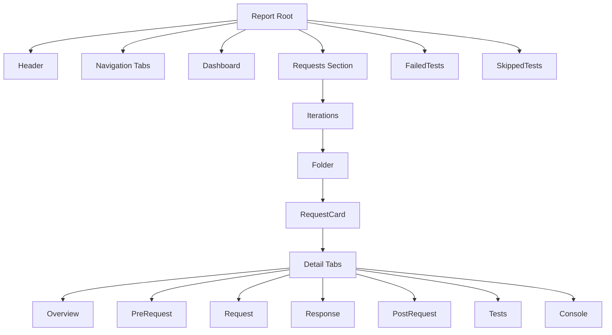
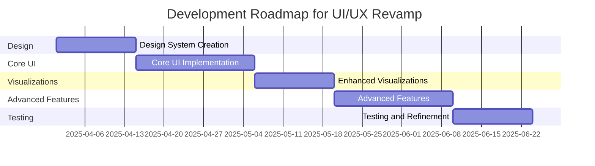

# Architecture & Workflow Diagrams

---

## Request Lifecycle

```mermaid
flowchart TD
    A[Pre-request Script(s)] --> B{Pre-request HTTP Calls}
    B -->|Multiple| C[Main HTTP Request]
    C --> D{Post-request HTTP Calls}
    D --> E[Post-request Script(s)]
    style A fill:#f9f,stroke:#333,stroke-width:2px
    style C fill:#bbf,stroke:#333,stroke-width:2px
    style E fill:#f9f,stroke:#333,stroke-width:2px
```

This diagram illustrates the full flow of a request, including nested HTTP calls made during pre-request and post-request scripts.

---

## UI Component Hierarchy



This diagram shows the hierarchical structure of the report UI components.

---

## Development Roadmap Timeline



This Gantt chart outlines the planned phases and timeline for the UI/UX modernization project.